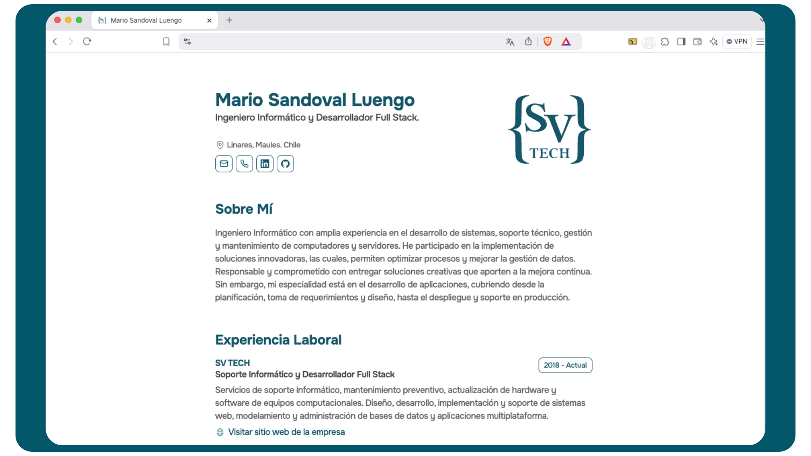

<p align="center">
  
</p>

<p align="center">
  <h1 align="center">Curriculum Online Minimalista</h1>
</p>

<div align="center">
  &nbsp;
  &nbsp;
  &nbsp;
  &nbsp;
</div>



## 📑 Descripción
Curriculum minimalista que permite generar un PDF y compartir la información mediante el entorno web.
Para la información presente en el proyecto, se utiliza un JSON, con la información estructurada, con la finalidad de poder actualizarlo de manera rápida y sencilla, sin la necesidad de modificar la información dentro del proyecto, consiguiendo modularizar y separar la información del proyecto en sí.

<br>

## 🛠️ Stack
- [Astro](https://astro.build)
- [Typescript](https://www.typescriptlang.org)
- CSS3
- [HotKeyPad](https://github.com/jesubohr/hotkeypad)

<br>

## 💻 Uso del repositorio
Para utilizar este repositorio de manera funcional, debes considerar lo siguiente:

### 1. Clona el repositorio
```
git clone https://github.com/svtech-code/CurriculumWeb
```

### 2. Accede al directorio del proyecto
```
cd CurriculumWeb
```

### 3. Instala las dependencias
- Yo utilizo **npm**
```
npm run dev
```

### 4. Modifica el archivo cv_template.json
- Cambia el nombre del archivo a cv.json
- Completa la información

<br>

### 5. Inicializa el proyecto
```
npm run dev
```
Luego de inicializar, abre tu navegador e ingresa al [http://localhost:4321](http://localhost:4321)

<br>


## ⚙️ Comandos
Alguno de los comandos más comunes para trabajar con el proyecto usando **npm**

|     |Comando           | Acción                                        |
| :-- | :--------------- | :-------------------------------------------- |
| 📦  |install        | Instalación de las dependencias del proyecto |
| 🏁  |run dev / star        | Inicializa un servidor de desarrollo local `localhost:4321` |
| 👨‍💻  |run build      | Comprueba errores y genera el empaquetado del proyecto `./dist/` |
| 🖥️  |run preview       | Vista previa del proyecto en local `localhost:4321` |

